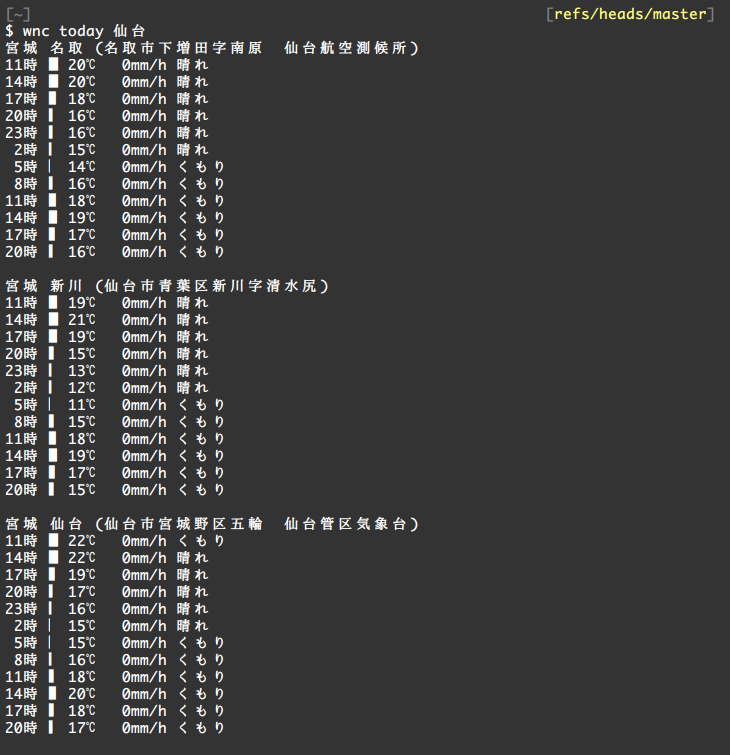
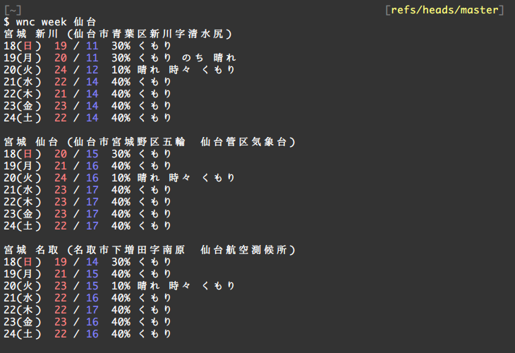
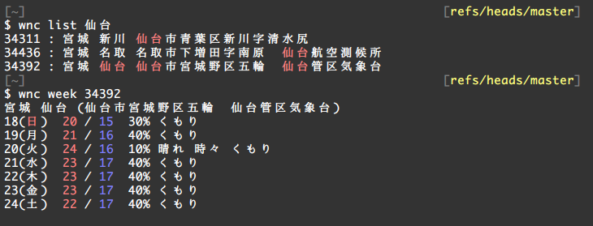

# go-weather
weather report in Japan

## Install

```
go get -u github.com/nocd5/go-weather/cmd/wnc
```

## Usage

```sh
$ wnc today 仙台
```


```sh
$ wnc week 仙台
```


```sh
$ wnc list 仙台
$ wnc week 34392
```

